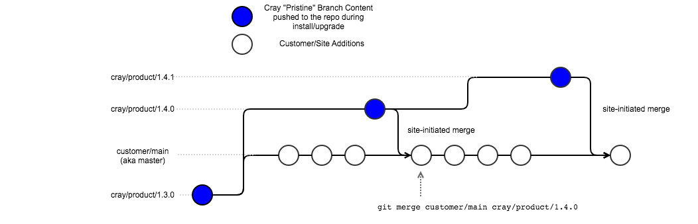

# cf-gitea-import

`cf-gitea-import` is a base image that can be used by product teams to import
their configuration content (Ansible plays and roles for use with CFS) into
a Gitea repository running on a Cray Shasta EX-1 system installed with CSM.

Users should provide a Dockerfile that installs their content (via RPMs or
however their content is packaged) and then use this base image to take
advantage of the import script to put it in Gitea. The resulting image
can be used in a Helm Chart/Kubernetes job to install and/or upgrade the
content for the system.

See the [CSM Compatibility Matrix](https://github.com/Cray-HPE/cf-gitea-import/wiki/CSM-Compatibility-Matrix)
for more information about what version of the `cf-gitea-import` image to
use in your product.

## Base Image

The `cf-gitea-import` base Docker image is built with Alpine Linux and includes
the dependencies required for the import script, namely python3, py3-requests,
and git. A few Python packages not in the Alpine distro are installed via the
included `requirements.txt` file in this repo.

## How This Works

For content that is managed by Git and stored in Gitea on EX-1 systems,
initial installation and upgrades of the content need to be handled carefully.
Shasta product content (like COS, CSM, Analytics, etc) needs to be refreshed
from time to time in such a way that new content can come in and not conflict
with changes made by the site admin.

Therefore, Shasta content will be pushed to "pristine" branches and protected
against further modification. This will allow HPE to update its products and
will allow the customer to modify the content in the git repository by using
their own site-defined git workflow, whether merging, rebasing or otherwise.
The diagram below describes the branch structure in each product's git
repository.



`cf-gitea-import` comes into play by being the mechanism that takes the product
content from Shasta build sources and imports it in the git repository.
Product content must be versioned with a [SemVer version](https://semver.org).
The `cf-gitea-import` utility assumes this fundamentally.

Furthermore, when a new version of a product is being imported, the utility has
the ability to find the previous semantic version and base the new content on
that pristine branch (see the `CF_IMPORT_BASE_BRANCH` =
`semver_previous_if_exists` environment variable). This is the default and will
rarely be changed under normal circumstances. If no base branch exists, the
default branch of the repository is used.

For this to work, `cf-gitea-import` also computes the format of the pristine
target branches to be:

```text
<gitea organization> / <product name> / <product (semantic) version>
```

## Example `DockerFile`

The example Dockerfile linked below shows how RPM content can be installed into an
image layer and then used with the cf-gitea-import image. This specific example
is for CLE content built on SLES SP1, version 1.3.0 from master repositories.

See an example for the CSM configuration content itself [here](https://github.com/Cray-HPE/csm-config/blob/master/Dockerfile).

## Example Usage (Kubernetes Job)

Using the content image based on the `cf-gitea-import` image above, a Kubernetes
job to use it is provided below. This job would likely be incorporated into
a Helm Chart. This `Job` assumes the image will be used on an EX-1 system with a
working Gitea installation in the services namespace via CSM.

See the example for the CSM configuration content itself [here](https://github.com/Cray-HPE/csm-config/tree/master/kubernetes/csm-config).

## `cray-import-config` Helm Base Chart

Note that a Helm base chart has also been created to run Jobs like the example
above and adds functionality such as the ability to run initContainers and
other containers alongside the main cf-gitea-import container. See the
[cray-import-config chart](https://github.com/Cray-HPE/cray-import-config/tree/master/charts/cray-import-config)
for more information on the base chart and [the csm-config chart](https://github.com/Cray-HPE/csm-config/tree/master/kubernetes/csm-config)
for an example of how the base chart is used.

## Environment Variables

All configuration options to the cf-gitea-import utility are provided as
environment variables. Some of these vary based on the product and its version
and can be specified in the product's Docker image (see example Dockerfile
above), and some of them will need to be specified on the system where the image
is running since they are environment specific (in the helm chart `values.yaml`
file).

### Product Environment Variables

* `CF_IMPORT_PRODUCT_NAME` = (no default)

> The name of the product that is being imported

* `CF_IMPORT_PRODUCT_VERSION` = (no default)

> The SemVer version of the product that is being imported, e.g. `1.2.3`. This
> can be overridden with a file located at `/product_version`, which takes priority.

* `CF_IMPORT_CONTENT`=  `/content`

> The filesystem location of the content that will be imported. When using
  `cf-gitea-import` as a base docker image, ensure that you put the importable
  content in this directory.

### Branching Environment Variables

* `CF_IMPORT_BASE_BRANCH` = `semver_previous_if_exists`

> Branch in the git repository that will serve as the base branch to the
  branch that will be created. Takes a branch name or the special value
  `semver_previous_if_exists` which will search the repository for a
  branch of the same format as the computed target branch for a version
  that is immediately previous in SemVer semantics. If nothing is
  provided, the repository default branch will be assumed.

* `CF_IMPORT_PROTECT_BRANCH` = `true`

> Protect the target branch from modification in Gitea after it has been pushed
  to the repository using the Gitea REST API. For security reasons, this should
  probably always be true.

* `CF_IMPORT_FORCE_EXISTING_BRANCH` = `false`

> If the computed target branch already exists in the repository,
  `cf-gitea-import` will exit without error unless this is set to true. If true
  and the branch exists, `cf-gitea-import` will reset the branch (`git checkout -B ...`)
  and force push the imported content to the branch, resulting in a new commit.

### Gitea Environment Variables

* `CF_IMPORT_GITEA_URL` = (no default)

> Base URL to Gitea such that the Gitea REST API exists at
  `CF_IMPORT_GITEA_URL` + `'/api/v1'`. This should be overridden when the image
  is used on a system or in development since it will be different for every
  environment.

* `CF_IMPORT_GITEA_ORG` = `cray`

> Gitea Organization where the `CF_IMPORT_GITEA_REPO` is/will be located

* `CF_IMPORT_GITEA_REPO` = <`CF_IMPORT_PRODUCT_NAME`>-config-management

> Gitea repository where the content will be imported.

* `CF_IMPORT_PRIVATE_REPO` = `true`

> The privacy of the Gitea repository, set to private by default so credentials
  are necessary to clone, commit, and push. This should be set to `true` for
  almost all repositories, especially those provided by Cray products.

* `CF_IMPORT_GITEA_USER` = `crayvcs`

> Gitea REST API user with sufficient permissions

* `CF_IMPORT_GITEA_PASSWORD` = (no default)

> Password for the `CF_IMPORT_GITEA_USER`. This should be overridden when the
  image is used on the system or in development since it will be different for
  every environment and NOT in a Docker image build.

## Overwriting Configuration Content

Files placed in `/shared` in this container are copied recursively into
`$CF_IMPORT_CONTENT` before the git import process starts. This allows
for Helm charts to run initContainers that can add or modify the content
before it is imported if that use case is necessary.

## Reporting Results

As of version 1.0.4, the import script will write a YAML file with the
record of what was imported to `/results/records.yaml`. The contents
are as follows:

```yaml
configuration:
  clone_url: https://vcs.system.dev.cray.com/vcs/cray/uan-config-management.git
  commit: 59dd762e08b3cf310183befe4007b30e42dc1cf0
  import_branch: cray/<product>/<product-version>
  ssh_url: git@vcs.system.dev.cray.com:cray/<product>-config-management.git
```

This information is typically used to populate the [cray-product-catalog](https://github.com/Cray-HPE/cray-product-catalog).

## Contributing

[Code owners](https://github.com/Cray-HPE/cf-gitea-import/blob/master/.github/CODEOWNERS): make a branch. Others, make a fork.

This repository follows the [CSM Gitflow Development Process](https://github.com/Cray-HPE/community/wiki/Gitflow-Development-Process).

Code format is [black](https://black.readthedocs.io/en/stable/) default settings, install to local env for use.

## Changelog

See the [CHANGELOG](CHANGELOG.md) for changes. This file uses the [Keep A Changelog](https://keepachangelog.com)
format.

## Built on

* Alpine Linux
* Python 3
* Python Requests
* GitPython
* SemVer
* Docker
* Good intentions

## License

This project is copyrighted by Hewlett Packard Enterprise Development LP and is
under the MIT license. See the [LICENSE](LICENSE) file for details.
